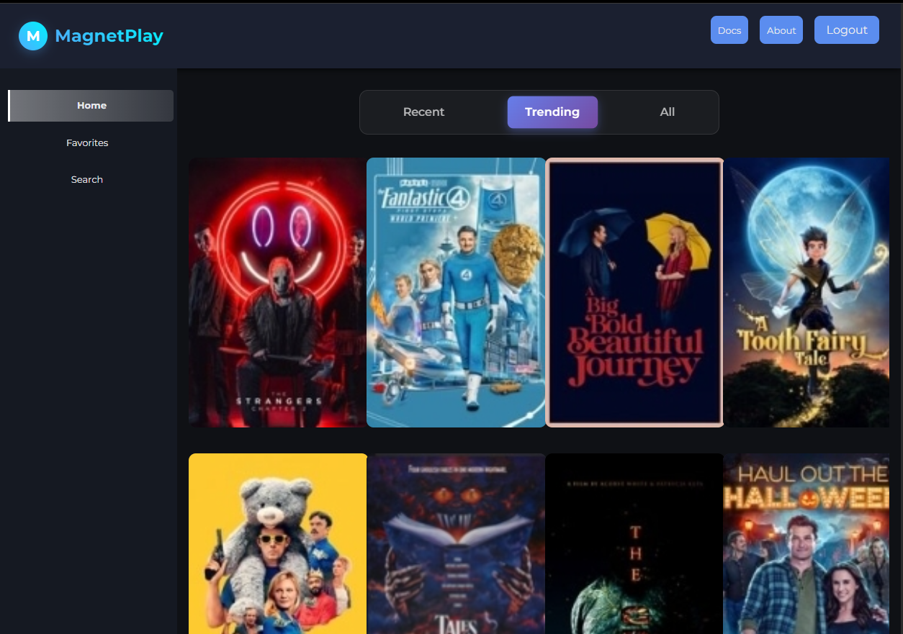
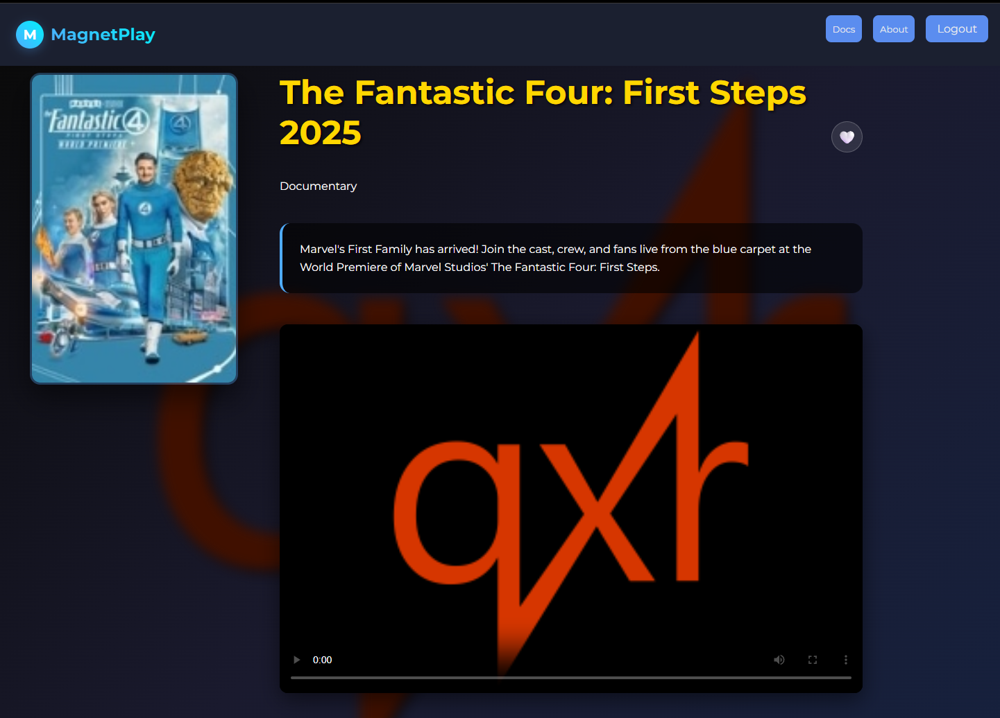
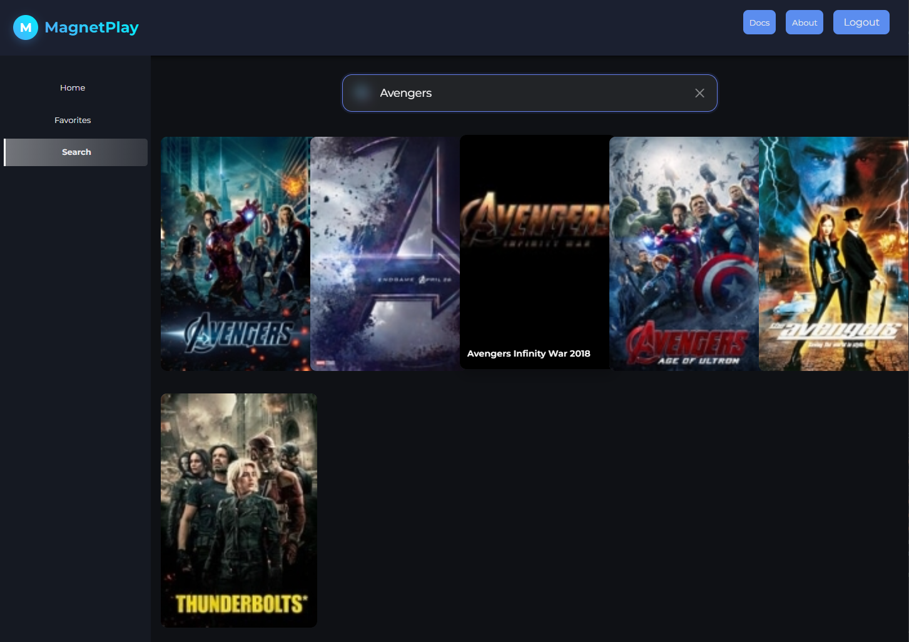
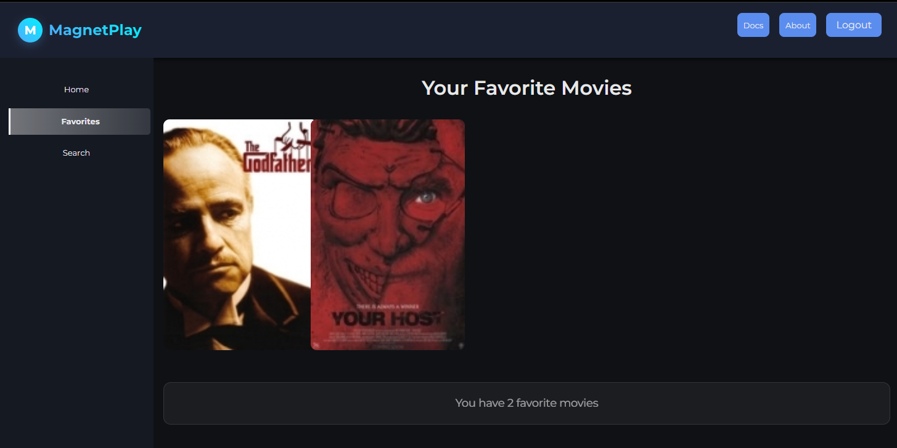
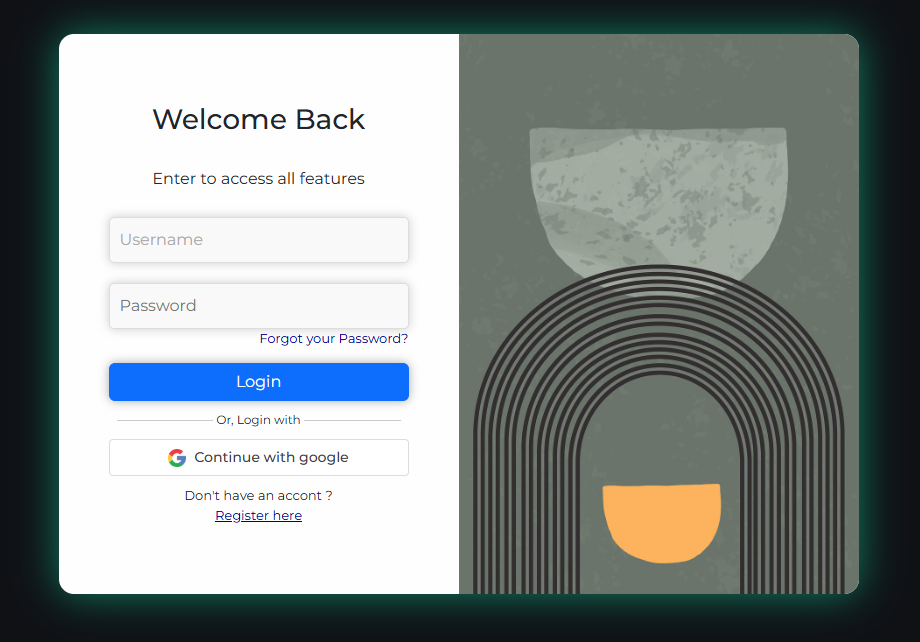

# MagnetPlay Frontend

A modern, feature-rich streaming platform frontend built with React, TypeScript, and Vite. MagnetPlay provides a experience for browsing and streaming movies using magnet links.

**Tech Stack:** React 18 • TypeScript • Vite

## 📸 Screenshots

### Home Page


_Browse movies by categories with smooth transitions and animations_

### Movie Details


_Detailed movie information with integrated video player_

### Search Feature


_Real-time search with debouncing and instant results_

### Favorites Collection


_Personal movie collection with easy management_

### Login Page


\*Login page to use authentication

## 🚀 Features

### Core Functionality

- **Movie Browsing**: Browse movies by categories (Recent, Trending, All)
- **Advanced Search**: Real-time search with debouncing for optimal performance
- **Video Streaming**: Built-in video player with subtitle support
- **Favorites System**: Add/remove movies to personal favorites collection
- **User Authentication**: Secure login and registration system

### Performance Optimizations

- **Intelligent Caching**: 30-minute TTL cache system for API responses
- **localStorage Persistence**: Cache survives browser sessions
- **Request Debouncing**: Prevents excessive API calls
- **Automatic Retries**: Failed requests retry with exponential backoff
- **Lazy Loading**: Content loads progressively for better UX

### User Experience

- **Smooth Animations**: Fade-in, slide-up, and staggered animations
- **Responsive Design**: Fully optimized for desktop, tablet, and mobile
- **Dark Theme**: Modern glassmorphism design with backdrop blur effects
- **Accessibility**: Reduced motion support and ARIA labels
- **Loading States**: Visual feedback for all async operations

## 📋 Prerequisites

- **Node.js**: >= 18.0.0
- **npm** or **yarn**
- **Backend API**: MagnetPlay backend service running

## 📦 Installation

### Development Setup

```bash
# Clone the repository
git clone https://github.com/sebastianvi1/magnetplay-frontend.git
cd magnetplay-frontend

# Install dependencies
npm install

# Start development server
npm run dev
```

## 📂 Project Structure

```
MagnetPlay-Frontend/
├── public/                    # Static assets
│   ├── images/               # Images and icons
│   └── bg-vid.webp          # Video placeholder
├── src/
│   ├── components/           # React components
│   │   ├── movieCard/       # Movie card component
│   │   ├── movie_details/   # Movie details page
│   │   ├── NavBar/          # Navigation bar
│   │   ├── SideBar/         # Sidebar navigation
│   │   └── search/          # Search component
│   ├── hooks/               # Custom React hooks
│   │   ├── useAuth.ts       # Authentication hook
│   │   └── useDebounce.ts   # Debouncing hook
│   ├── models/              # TypeScript interfaces
│   │   └── movieModel.ts    # Movie data model
│   ├── pages/               # Page components
│   │   ├── home/            # Home page
│   │   ├── favorites/       # Favorites page
│   │   └── search/          # Search page
│   ├── service/             # API services
│   │   └── MovieService.ts  # Movie API calls
│   ├── utils/               # Utility functions
│   │   └── cache.ts         # Cache implementation
│   ├── App.tsx              # Main app component
│   ├── main.tsx             # Entry point
│   └── global.css           # Global styles
├── .env.example             # Environment template
├── vite.config.ts           # Vite configuration
├── tsconfig.json            # TypeScript config
└── package.json             # Dependencies
```

## 🎨 Key Components

### Home Page

- Category navigation (Recent, Trending, All)
- Grid layout with responsive design
- Smooth category transitions with animations
- Cached data for instant loading

### Search

- Real-time search with 700ms debounce
- Loading states and error handling
- Staggered animation for results
- Empty state messaging

### Movie Details

- Full movie information display
- Integrated video player
- Favorite button with authentication
- Background blur effect
- Subtitle support (English, Spanish)

### Favorites

- Personal movie collection
- Grid layout matching home page
- Remove from favorites functionality
- Empty state for new users

## 🔧 Available Scripts

````bash
# Development
npm run dev          # Start dev server (port 5173)

# Production
npm run build        # Build for production
npm run preview      # Preview production build


## 🎯 API Integration

### Endpoints Used

```typescript
// Movies
GET    /api/movies              // All movies
GET    /api/movies/recent       // Recent movies
GET    /api/movies/trending     // Trending movies
GET    /api/movies/:id          // Movie by ID
GET    /api/movies/search       // Search movies

// Favorites
GET    /api/users/:id/favorites           // User favorites
POST   /api/users/:id/favorites/:movieId  // Add favorite
DELETE /api/users/:id/favorites/:movieId  // Remove favorite
GET    /api/users/:id/favorites/:movieId/check // Check favorite

// Streaming
GET    /api/torrent/:magnetUri  // Stream video
````

## 📄 License

This project is licensed under the MIT License - see the [LICENSE](LICENSE) file for details.

## 📞 Support

For support, email sebastianvh86@gmail.com or open an issue on GitHub.
